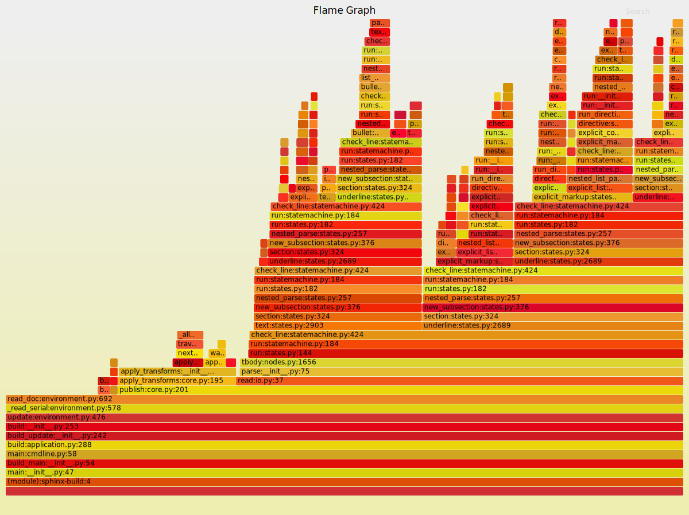

vmprof-flamegraph
=================

Convert vmprof profile data into flamegraph format [1].

[1] http://www.brendangregg.com/FlameGraphs/cpuflamegraphs.html

Install
--------

1. Download `flamegraph.pl` and put it in PATH directory.
2. `pip install vmprof-flamegraph`

Usage
-----

.. code-block::

   $ vmprof-flamegraph.py --prune_level=40 --prune_percent=0.1 | flamegraph.pl > output.svg

Example
--------

Building Python document with Sphinx.

